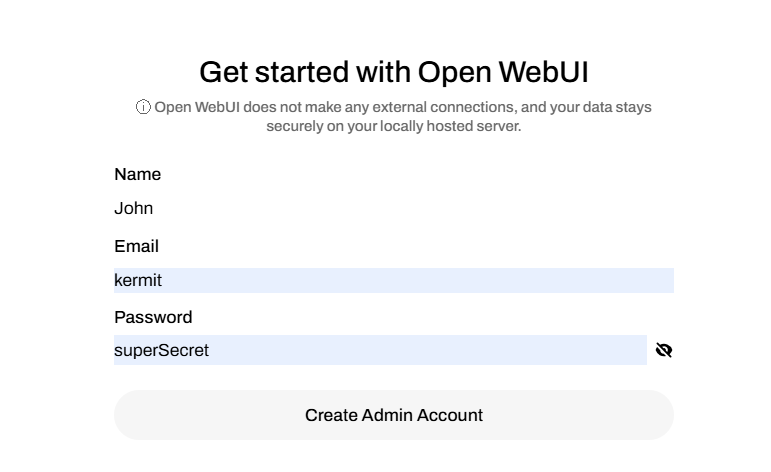
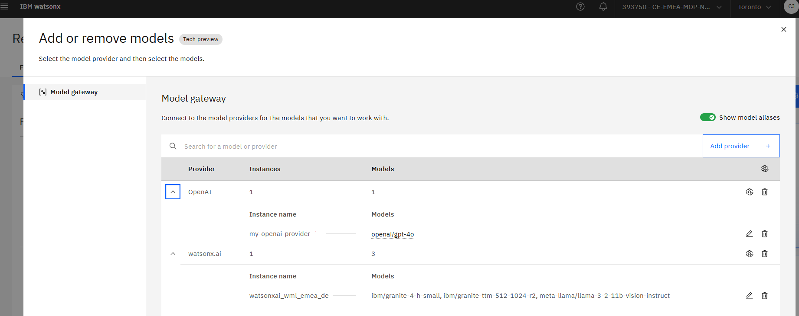

# Granite Retrieval and Image Research Agents

## Lab introduction

During this lab we will develop 2 agents that are using IBM Granite 4 to plan and execute:

- Granite Retrieval Agent
- Image Resarch Agent

Here are the technologies/frameworks we will use for development and execution:

- python as programming language
- [CrewAI](https://www.crewai.com/?utm_source=ibm_developer&utm_content=in_content_link&utm_id=tutorials_awb-build-agentic-rag-system-granite) as one of the agentic framework. CrewAI emphasizes role-based collaboration with a workplace-inspired metaphor. Each agent has a defined role, responsibilities, and access to tools, making the system intuitive for team-based workflows. 
- [AutoGen](https://microsoft.github.io/autogen/stable//index.html) as another agentic framework, AutoGen focuses on conversational agent architecture, emphasizing natural language interactions and dynamic role-playing
- [Open WebUI](https://docs.openwebui.com/category/-web-search?utm_source=ibm_developer&utm_content=in_content_link&utm_id=tutorials_awb-build-agentic-rag-system-granite) as a local workbench to load and chat with the agents
- **optional** use [Ollama](https://ollama.com/) locally to run the small and powerful Granite 4 H Tiny model!
- **optional** use a Web Search engine in Open WebUI, thanks to Open WebUI you can configure the engine of your choice (Tavily, SearXNG... )
- **Granite 4** and llama vision models running on watsonx.ai on IBM cloud

## Why Granite 4 for these agents?

Granite 4 introduces a **hybrid Mamba-2/Transformer** architecture (with MoE variants) that targets **lower memory use and faster inference**, making it a strong fit for agentic RAG and function-calling workflows. It uses **>70% lower memory** and **~2× faster inference** vs. comparable models, which helps these agents run locally or on modest GPUs with lower cost and latency. Models are **Apache-2.0 licensed**, **ISO 42001 certified**, and cryptographically signed for governance and security.

The **Granite 4** family emphasizes **instruction following, tool calling, RAG, JSON output, multilingual dialog, and code (incl. FIM)**, aligning with both agents’ needs.

- **H-Small (32B total / ~9B active)** is a 32B parameter long-context instruct model finetuned from Granite-4.0-H-Small-Base. This model is developed using a diverse set of techniques with a structured chat format, including supervised finetuning, model alignment using reinforcement learning, and model merging. **Granite 4.0 instruct** models feature improved instruction following (IF) and tool-calling capabilities, **making them more effective in enterprise applications**.

  > You will have the option to use this model running on IBM Cloud.

- **H-Tiny (7B total / ~1B active)** is optimized for **low-latency, small-footprint deployments**—ideal for the Image Researcher’s quick tool calls and orchestration steps.

  > You will have the option to use this model running locally with ollama

- **H-Micro (3B total)** a dense hybrid model with 3B parameters.

- **Micro (3B total)** a dense model with a conventional attention-driven transformer architecture, to accommodate platforms and communities that do not yet support hybrid architectures.
  > You will have the option to use this model running locally with ollama

---

# 🔑 Prepare your environment

- **Common Installation Instructions**: The setup for **Open WebUI** remains the same for both agents.

## **1. Set up your python environment**

This lab has been tested with python 3.11, also this is recommended to use an IDE like Visual Studio Code but this is not mandatory.

If you already have a 3.11 python environment, you can create a new virtual environment with [venv](https://docs.python.org/3/library/venv.html).

```
python -m venv /path/to/new/virtual/environment
source /path/to/new/virtual/environment/bin/activate
```

If you have a different python version, either update it or manage multiple python versions with [uv](https://docs.astral.sh/uv/concepts/python-versions/#python-version-files) or pyenv.

```
uv venv --python 3.11.6
```

You

## **2. Install Open WebUI**

```bash
pip install open-webui
open-webui serve
```

To test the successful installation, open your browser on [http://localhost:8080]. When first connecting, you will be asked to enter your name, eventually change email and password then click **Create Admin Account** button.



## **3. LLMs call: use watsonx.ai Model Gateway**

Today we will use Granite 4 on IBM Cloud to run the labs, as we will share with you a temporary access to the model (shared api key only available for the current day). However, the default implementation of the lab is to use ollama to run the models locally so you can run on it later on without external dependencies. 

> With [Model Gateway](https://www.ibm.com/docs/en/watsonx/saas?topic=models-model-gateway-preview), organizations can integrate IBM’s Granite models alongside industry-leading foundation models from OpenAI, Anthropic, NVIDIA, Cerebras and more without vendor lock-in. This AI-agnostic approach enables businesses to maintain control, enhance flexibility and optimize costs, regardless of where models are hosted.

Model Gateway is the final pillar in watsonx.ai’s multi-model strategy, giving customers the ultimate choice in using third-party hosted models on platform. Users can leverage third-party models to develop agents using any OOTB templates, and quickly deploy them as AI services.

For this lab, we have created an account on IBM Cloud so you can use Granite 4 hosted on watsonx.ai on IBM Cloud. With the model gatewat, you can securely access and interact with foundation models from multiple providers like AWS, Anthropic, Azure.. with **openai** compatible REST API. Providers are registered on the gateway, then you can import models for each provider and decide which model will be visible for users based on IAM access management. You will be provided an api key by the instuctors that only has access to this gateway and models.




### **Test the model gateway with Granite 4 H Small**

Before using it in the lab, double check that it is working fine and that the provided api key is working.

Export your key:

```
export IBM_CLOUD_APIKEY="xxxxxxxx"
```

Then run this openai curl command to see Granite 4 H Small in action with function calling:

```
curl --location 'https://ca-tor.ml.cloud.ibm.com/ml/gateway/v1/chat/completions' \
--header 'Content-Type: application/json' \
-H "Authorization: Bearer ${IBM_CLOUD_APIKEY}" \
--data '{
    "messages": [
        {
            "role": "system",
            "content": "The current date and time is 2023-07-22T13:57:34+02:00. Be very presumptive when guessing the values of function parameters."
        },
        {
            "role": "user",
            "content": "What things can I do in Amsterdam?"
        }
    ],
    "model": "ibm/granite-4-h-small",
    "max_tokens": null,
    "stream": false,
    "n": 1,
    "temperature": 0.0,
    "functions": [
        {
            "name": "planner",
            "description": "Plan a public transport trip from train station A to station B in the Netherlands.",
            "parameters": {
                "type": "object",
                "properties": {
                    "origin": {
                        "description": "origin station name in the Netherlands for the trip. Be presumtive and accept very short shorthands.",
                        "type": "string"
                    },
                    "destination": {
                        "description": "destination station name in the Netherlands for the trip. Be presumptive and accept very short shorthands.",
                        "type": "string"
                    },
                    "trip_date_time": {
                        "description": "Requested DateTime for the departure or arrival of the trip in '\''YYYY-MM-DDTHH:MM:SS+02:00'\'' format. The user will use a time in a 12 hour system, make an intelligent guess about what the user is most likely to mean in terms of a 24 hour system, e.g. not planning for the past.",
                        "type": "string"
                    },
                    "departure": {
                        "description": "True to depart at the given time, False to arrive at the given time",
                        "type": "boolean"
                    },
                    "language": {
                        "description": "Language of the input text",
                        "type": "string"
                    }
                },
                "required": [
                    "origin",
                    "destination",
                    "departure",
                    "language"
                ]
            }
        },
        {
            "name": "train_station_departures",
            "description": "Show the departures from a train station in the Netherlands",
            "parameters": {
                "type": "object",
                "properties": {
                    "departure_station": {
                        "description": "Departure train station in the Netherlands",
                        "type": "string"
                    },
                    "dateTime": {
                        "description": "Requested DateTime for the departures or arrival of the trip in '\''YYYY-MM-DDTHH:MM:SS+02:00'\'' format.",
                        "type": "string"
                    },
                    "transport_type": {
                        "description": "Type of departures to show. Either '\''train'\'' or '\''bus'\''",
                        "enum": [
                            "train",
                            "bus"
                        ],
                        "type": "string"
                    }
                },
                "required": [
                    "departure_station",
                    "dateTime"
                ]
            }
        },
        {
            "name": "outings",
            "description": "Show the available outings in an area in the Netherlands",
            "parameters": {
                "type": "object",
                "properties": {
                    "area": {
                        "description": "Area in the Netherlands",
                        "type": "string"
                    }
                },
                "required": [
                    "area"
                ]
            }
        },
        {
            "name": "show_screen",
            "description": "Determine which screen the user wants to see",
            "parameters": {
                "type": "object",
                "properties": {
                    "screen_to_show": {
                        "description": "type of screen to show. Either '\''account'\'': '\''all personal data of the user'\'', '\''settings'\'': '\''if the user wants to change the settings of the app'\''",
                        "enum": [
                            "account",
                            "settings"
                        ],
                        "type": "string"
                    }
                },
                "required": [
                    "screen_to_show"
                ]
            }
        },
        {
            "name": "custom_search",
            "description": "answer all questions about NS",
            "parameters": {
                "title": "QAToolInput",
                "type": "object",
                "properties": {
                    "question": {
                        "title": "Question",
                        "description": "question about NS",
                        "type": "string"
                    }
                },
                "required": [
                    "question"
                ]
            }
        }
    ]
}'
```


## **4. Optional: Set Up Ollama**

> We do not recommand to setup ollama locally unless you know your computer can handle it. You also need to have a performant network to download the models. Micro model is about ~8Gb and H-Tiny is about ~15Gb. 

Using the models locally will show you that Granite 4 are small but performant!

Go to [ollama.com](https://ollama.com/) and hit Download!

Once installed, pull the Granite 4 Micro model for the Granite Retrieval Agent (not needed if you use granite-4-h-small from IBM Cloud)

```
ollama pull ibm/granite4:latest
```

Pull the Granite 4 Tiny model for the Image Researcher (not needed if you use granite-4-h-small from IBM Cloud)

```
ollama pull ibm/granite4:tiny-h
```

Pull the Granite 3.2 vision model for the vision model for both labs (not needed if you use llama-3-2-11b-vision-instruct from IBM Cloud)

```
ollama pull granite3.2-vision:2b
```


## **5. Optional: Set Up Web Search in Open WebUI**

- **Flexible Web Search**: Agents use the Open WebUI search API, integrating the search engine of your choice by following the [Configuration guide](https://docs.openwebui.com/category/web-search). As an example, you can easily create a account on [tavily](https://app.tavily.com/home) with a GitHub or Google account and use tavily api key in Open Web UI, but please not you are limited in number of calls.

* **Tavily**: For example for Tavily, find your api key on Tavily home page. Then open your Open WebUI on [http://localhost:8080](http://localhost:8080) and in the bottom left corner, click `kermit` and open the `Settings` menu. On the bottom left of the panel, click the grey `Admin settings` menu. Click on `Web Search` then :

  - toggle the button to activate the search
  - in select web search engine, select `tavily`
  - in `Tavily API Key` paste your key
  - in select web loader engine, select `tavily`

* **SearXNG**: If you want to use SearXNG as the engine, proceed to the following section.

## **6. Optional: Setup SearXNG for Web Search**

SearXNG is a metasearch engine that aggregates retrieved information from multiple search engines. The reason for its inclusion in this architecture is that it requires no SaaS API key, as it can run directly on your laptop.

For more in-depth instructions on how to run Searxng, refer to the Open WebUI Documentation, detailing integration with Searxng. Here is a quick walk-through:

1. Create configuration files for Searxng.

```
mkdir ~/searxng
cd ~/searxng
```

2. Create a new file in the ~/searxng directory called settings.yml and copy this code into the file.

```
# see https://docs.searxng.org/admin/settings/settings.html#settings-use-default-settings
 use_default_settings: true

 server:
   secret_key: "ultrasecretkey"  # change this!
   limiter: false
   image_proxy: true
   port: 8080
   bind_address: "0.0.0.0"

 ui:
   static_use_hash: true

 search:
   safe_search: 0
   autocomplete: ""
   default_lang: ""
 formats:
     - html
     - json
```

3. Create a new file in the ~/searxng directory called uwsgi.ini. You can populate it with the values from the example uwsgi.ini from Searxng Github.

4. Run the SearXNG docker image in your terminal.

```
docker pull searxng/searxng
 docker run -d --name searxng -p 8888:8080 -v ~/searxng:/etc/searxng --restart     always searxng/searxng:latest
```

Note: SearXNG and Open WebUI both run on port 8080, so we can map SearXNG to the local machine port 8888.

This agent uses the SearXNG API directly, so you do not need to follow the steps in the Open WebUI documentation to setup SearXNG in the UI of Open WebUI. It is only necessary if you want to use SearXNG via the Open WebUI interface apart from this agent.

# 📚 Agents development

Here are the links for each agent tutorial, you can run in any order you want. Use the link in the latest column to open the tutorial.

| Feature                 | Description                                                          | Models Used                                                                                                                                                 | Code Link                                                                  | Link                                                                                                              |
| ----------------------- | -------------------------------------------------------------------- | ----------------------------------------------------------------------------------------------------------------------------------------------------------- | -------------------------------------------------------------------------- | ----------------------------------------------------------------------------------------------------------------- |
| Granite Retrieval Agent | General Agentic RAG for document and web retrieval using Autogen/AG2 | **Granite-4.0-H-Small (ibm-granite/granite-4.0-h-small:latest)** [Granite 4 h small on HuggingFace](https://huggingface.co/ibm-granite/granite-4.0-h-small) | [granite_autogen_rag.py](./granite_autogen_rag.py)                         | [Build a multi-agent RAG system with Granite locally](./granite_rag.md)                                           |
| Image Research Agent    | Image-based multi-agent research using CrewAI with Granite Vision    | **Granite-4.0-H-Small (ibm-granite/granite-4.0-h-small:latest)** [Granite 4 h small on HuggingFace](https://huggingface.co/ibm-granite/granite-4.0-h-small) | [image_researcher_granite_crewai.py](./image_researcher_granite_crewai.py) | [Build an AI research agent for image analysis with Granite 4.0 Reasoning and Vision models](image_researcher.md) |

---

# Extra work !

If you had enough time you can test specific granite 3 models like the Time Series model and the Guardian model.

You can easily test those models through notebooks in your python environment.

## Set up your python environment

There is a collection of granite workshop available to you, from this collection we will just run the time series workshop.

As you already ran python for the previous lab, you should be able to run notebooks locally, so please follow the setup for Jupyter:

[Granite workshop pre-work][https://ibm.github.io/granite-workshop/pre-work/#install-jupyter]

## Energy Demand Forecasting with Granite Timeseries Lab

Lab reference: [Energy Demand Forecasting with Granite Timeseries](https://ibm.github.io/granite-workshop/lab-3/)

Download the notebook directly from [https://github.com/IBM/granite-workshop/blob/main/notebooks/Time_Series_Getting_Started.ipynb] and run it with:

```
jupyter notebook notebooks/Time_Series_Getting_Started.ipynb
```

## Guardian lab

Download a sample notebook to demonstrate Granite Guardian capabilities:
[https://github.com/ibm-granite/granite-guardian/blob/main/cookbooks/granite-guardian-3.3/quickstart.ipynb]
