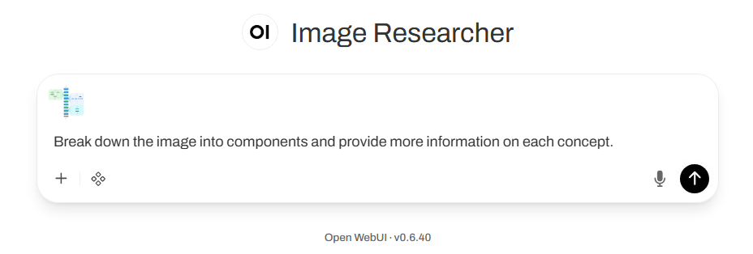
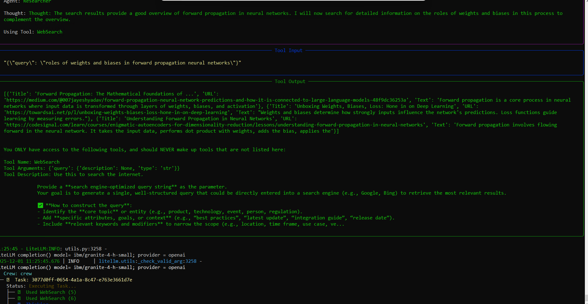
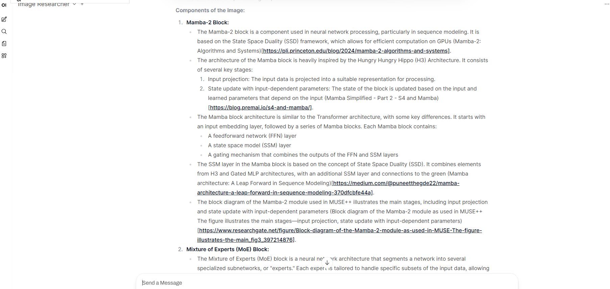

## **Image Research Agent**

The **Image Research Agent** analyzes images and performs multi-agent research on image components using **Granite 4** with the **CrewAI** framework.

In this tutorial, we'll guide you through building an AI research agent that is capable of conducting in-depth research based on image analysis. Using the Granite 3.2 Vision Model alongside the Granite 3.2 8B Language Model, which offers enhanced reasoning capabilities, you'll learn how to create an advanced image researcher. The best part? You can run everything locally using Ollama, Open WebUI and Granite, ensuring a private, cost-effective solution.

We'll leverage Crew AI as our agentic AI framework, demonstrating how to orchestrate parallel, asynchronous research tasks across various topics. This approach enables efficient exploration of complex visuals, transforming images into actionable insights. Additionally, CrewAI is constructed upon Langchain, an open-source project offering an array of useful tools for agents.

To power the research, we'll incorporate retrieval-augmented generation (RAG), enabling the agent to fetch relevant information from both web sources and user-provided documents. This ensures that the generated insights are not only accurate but also grounded in up-to-date and contextually relevant content in real-time.

## Building on our previous work

In our previous tutorial `Build a multi-agent RAG system with Granite 4`, we demonstrated how to build an agent that constructs a sequential plan to accomplish a goal, dynamically adapting as the task progresses. In this tutorial, we'll explore alternative methods of agent collaboration by developing a research agent that first identifies a structured plan of researchable topics based on an image and user instructions. It will then commission multiple parallel research agents to investigate each topic, leveraging RAG to pull insights from the web and user documents, and finally synthesize the findings into a comprehensive report.

## The sample application: Turning images into knowledge

They say a picture is worth a thousand words, but what if AI could turn those words into actionable insights, filling gaps in your understanding and offering deeper context? That’s exactly what this Image Research Agent does. Whether it's a complex technical diagram or a historical photograph, the agent can break down its components and educate you on every relevant detail.

This Image Research Agent supports these use cases:

  - Architecture Diagrams: Understand components, protocols, and system relationships.

  - Business Dashboards: Explain KPIs, metrics, and trends in BI tools.

  - Artwork and Historical Photos: Analyze artistic styles, historical context, and related works.

  - Scientific Visualizations: Interpret complex charts, lab results, or datasets.

By combining vision models, agentic workflows, and RAG-based research, this solution empowers users to transform visual data into meaningful insights. The result? Informed decision-making, deeper learning, and enhanced understanding across industries.

### **How the AI agents work togethe:**


### **Image Researcher in Action:**


### 🔹 Key Features:

* **Image-based multi-agent research** using CrewAI.
* **Granite 4 Tiny-H** powers low-latency orchestration and tool calls; pair with a vision backend of your choice.
* Identifies objects, retrieves related research articles, and provides historical backgrounds.
* Demonstrates a **different agentic workflow** from the Retrieval Agent.


## Environment setup

The environment has been setup as per the readme instructions.


## **Develop the agent**


### Step 1. Set up connections to the two LLMs

CrewAI uses **LiteLLM** to connect to a wide variety of Language Models (LLMs). This integration provides extensive versatility, allowing you to use models from numerous providers with a simple, unified interface. 

First, we need to set up connections to the two LLMs we will be using:

  -  **Llama 3.2 11b Vision Instruct** (or Granite 3.2 vision locally with ollama) Vision LLM for transforming images into descriptive text

  -  **Granite 4.0 H Small** (or Granite 4.0 h Tiny locally with ollama) for all other language-related tasks including planning and reasoning.

Open [image_researcher_granite_crewai.py](image_researcher_granite_crewai.py) in your favorite IDE.

Change the default parameters of the agent to use watsonx.ai model through openai compatible API, from:
```py
class Pipe:
    class Valves(BaseModel):
        TASK_MODEL_ID: str = Field(default="ollama/ibm/granite4:tiny-h")
        VISION_MODEL_ID: str = Field(default="ollama/granite3.2-vision:2b")
        OPENAI_API_URL: str = Field(default=open_webui_config.OLLAMA_BASE_URL or "http://localhost:11434")
        OPENAI_API_KEY: str = Field(default="ollama")
        VISION_API_URL: str = Field(default=open_webui_config.OLLAMA_BASE_URL or "http://localhost:11434")
```
to:
```py
class Pipe:
    class Valves(BaseModel):
        TASK_MODEL_ID: str = Field(default="openai/ibm/granite-4-h-small")
        VISION_MODEL_ID: str = Field(default="openai/meta-llama/llama-3-2-11b-vision-instruct")
        OPENAI_API_URL: str = Field(default="https://ca-tor.ml.cloud.ibm.com/ml/gateway/v1")
        OPENAI_API_KEY: str = Field(default="")
        VISION_API_URL: str = Field(default="https://ca-tor.ml.cloud.ibm.com/ml/gateway/v1")
```

Now, update the base llm configuration and add a attribute to switch from ollama to openai:

```py
        llm = LLM(
            model=default_model,
            base_url=base_url,
            api_key=api_key,
            temperature=model_temp,
            stop=["↵↵↵↵"],
            api_type="openai"       ## Add this for watsonx.ai inference through openai
        )
```

Update the instructions for the vision model, in the file local ollama syntax is used, you need to switch to openai instructions

Remove the block 
```py
        image_descriptions = ""
        if image_urls:
            messages = [
                {
                    "role": "user",
                    "content": image_query,
                    "images": image_urls
                }
            ]

            # Here we are going to use the ollama client directly to describe the image
            # For some reason, the LiteLLM client inside CrewAI was not properly forwarding the image over to Ollama
            # Contributions welcome if you can fix this and make it backend provider agnostic :-)
            index_of_slash = vision_model.find("/")
            ollama_vision_model = vision_model
            if index_of_slash >=0:
                ollama_vision_model = vision_model[index_of_slash + 1:]
            ollama_client = OllamaClient(
                host=vision_url,
            )
            ollama_output = await ollama_client.chat(
                model=ollama_vision_model,
                messages = messages,
            )
            image_descriptions = ollama_output['message']['content']
```
And udpdate with:
```py
            image_descriptions = ""
            if image_urls:
              messages =  [
                {
                    "role": "user",
                    "content": [
                        {
                            "type": "text",
                            "text": image_query
                        },
                        image_info[0]
                    ] 
                }
             ]

                # Use openai
              vision_llm = LLM(
                model=vision_model,
                base_url=base_url,
                api_type="openai",
                api_key=api_key,
                max_tokens=2000,
                temperature=0.7,
                stop=["↵↵↵↵"]           
                
              )

            response = vision_llm.call(messages)
            image_descriptions = response
```


### Step 2. Tools definition


Have a look to the tools section on how the Web Search and Knowledge are defined:

```py

       ##################
        # Tool Definitions
        ##################
        @tool("WebSearch")
        def do_web_search(query: str) -> str:
            """Use this to search the internet. 

            Provide a **search engine–optimized query string** as the parameter. 
            Your goal is to generate a single, well-structured query that could be directly entered into a search engine (e.g., Google, Bing) to retrieve the most relevant results. 

            ✅ **How to construct the query**:
            - Identify the **core topic** or entity (e.g., product, technology, event, person, regulation).
```

```py
       @tool("Knowledge Search")
        def do_knowledge_search(search_instruction: str) -> str:
            """Use this tool if you need to obtain information that is unique to the user and cannot be found on the internet.
            Given an instruction on what knowledge you need to find, search the user's documents for information particular to them, their projects, and their domain.
            This is simple document search, it cannot perform any other complex tasks.
            This will not give you any results from the internet. Do not assume it can retrieve the latest news pertaining to any subject.
            """
            if not search_instruction:
                return "Please provide a search query."
```


### Step 3. Define the Research Item Identifier agent

This agent analyzes the image description and user query to identify key features and concepts requiring research.

Inputs:

  - Image description generated by the Image Explainer.
    User's research goal or context.

Outputs:

  - Structured list of items for further research.


We are using a crew that consists of a single task and a single agent. The output_pydantic=ResearchItems portion instructs the LLM to output its structure into a Python object that can be directly leveraged in the next step of the plan.

```py
        #########################
        # Crew Agent Config
        #########################

        # Item Identifier Crew
        item_identifier = Agent(
            role="Item Identifier",
            goal="Identify which concepts that are in a described image need to be researched in order to accomplish the goal.",
            backstory=ITEM_IDENTIFIER_PROMPT,
            llm=llm,
            use_system_prompt=False,
            verbose=True,
        )
        identification_task = Task(
            description="Thoroughly identify all items and concepts that are part of the image that will need to be researched in order to accomplish the goal. Goal: {goal} \n Image Description: {image_description}",
            agent=item_identifier,
            expected_output="A list of items and concepts that need to be researched in order to accomplish the goal.",
            output_pydantic=ResearchItems,
            callback=self.log_research_items
        )
        identifier_crew = Crew(
            agents=[item_identifier],
            tasks=[identification_task],
            process=Process.sequential,
            share_crew=False,
            verbose=True,
        )
```

### Step 4. Define the Research Crew

For each identified research item, a separate Research agent runs asynchronously, using RAG to search the web and user documents. The beauty of receiving the output of the previous agent as a Python list object is that we can now provide that list of research items to our Research Crew to kick off parallel, asynchronous research tasks for each item in the list.

Inputs:

  - List of research items from the Research Item Identifier.

Outputs:

  - Detailed information, including references and explanations, for each item.


```py
        # Research Crew
        available_tools = [do_web_search]
        if include_knoweldge_search:
            available_tools.append(do_knowledge_search)
        researcher = Agent(
            role="Researcher",
            goal="You will be given a step/instruction to accomplish. Fully answer the instruction/question using document search or web search tools as necessary.",
            backstory=ASSISTANT_PROMPT,
            llm=llm,
            use_system_prompt=False,
            verbose=True,
            max_iter=max_research_iters,
            tools=available_tools,
        )
        research_task = Task(
            description="Fulfill the instruction given. {item_name} {research_instructions}",  # Keep in mind the previously gathered data from previous steps: {previously_executed_steps}',
            agent=researcher,
            expected_output="Information that directly answers the instruction given. If your answer references websites or documents, provide in-line citations in the form of hyperlinks for every reference.",
            callback=self.log_task_completion
        )
        research_crew = Crew(
            agents=[researcher],
            tasks=[research_task],
            share_crew=False,
            verbose=True,
        )
```

### Step 5. Pulling the agents together

Have now a look to the `# Begin Agentic Workflow` section.

Make a call to the Granite Vision model to describe the image:

```py
            image_query = DEAULT_IMAGE_VERBALIZER_PROMPT
            if latest_instruction:
                image_query += f"\n\nUse the following instruction from the user to further guide you: {latest_instruction}"
            if chat_history_text:
                image_query += f"\n\nAlso use the previous chat history to further guide you: {chat_history_text}"
```
```py
          response = vision_llm.call(messages)
          image_descriptions = response
```

Use the “Identifier Crew” to create a structured Python object representing all of the items contained in the image that need to be researched:

```py
        await identifier_crew.kickoff_async(inputs)
```

Then, use an asynchronous, parallel kickoff of the “Research Crew” to perform retrieval for each research query if valve `Run Parallel Tasks` has been activated (deactivated by default for local ollama execution):

```py
        outputs = []
        try:
            if run_parallel_tasks:
                outputs = await research_crew.kickoff_for_each_async(tasks)
            else:
                for task in tasks:
                    outputs.append(await research_crew.kickoff_async(task))
        except Exception as e:
            logging.error(f"Error in research crew: {e}")
            outputs = research_task.output.raw
```

Finally, summarize the findings into a comprehensive report:

```py
        # Create the final report
        await self.emit_event_safe("Summing up findings...")
        prompt = f"""Thoroughly answer the user's question, providing links to all URLs and documents used in your response. You may only use the following information to answer the question. 
        If no reference URLs exist, do not fabricate them. If the following information does not have all the information you need to answer all aspects of the user question, then you may highlight those aspects. 
        User query: {DEFAULT_INSTRUCTION} \n\n Image description:  {image_descriptions} \n\n Gathered information: {outputs}"""
        final_output =  await anyio.to_thread.run_sync(lambda: llm.call(prompt))
        return final_output
```

## Run the agent: Analyzing a sample image


### **1. Import the Agent Python Script into Open WebUI**

1. Open `http://localhost:8080/` and log into Open WebUI.
2. Admin panel → **Functions** → **+ New Function** to add.
3. Name it `Image Researcher Agent` and add a description to your function, eg "This agent analyzes a image description and make a web search on identifed key features and concepts"
4. Paste the relevant Python script:
   * `image_researcher_granite_crewai.py` (Retrieval Agent) 
5. **Save** and **Confirm** the import
6. **Enable** the function by clicking the toggle button
7. Adjust settings by clicking the **wheel** ⚙️ icon:


    | Parameter                | Description                               | Default Value                                     |
    | ------------------------ | ----------------------------------------- | ------------------------------------------------- |
    | task_model_id            | Primary model for task execution          | `openai/ibm/granite-4-h-small`                    |
    | vision_model_id          | Vision model for image analysis           | `openai/meta-llama/llama-3-2-11b-vision-instruct` |
    | openai_api_url           | API endpoint for OpenAI-style model calls | `https://ca-tor.ml.cloud.ibm.com/ml/gateway/v1`   |
    | openai_api_key           | API key for authentication                | your IBM Cloud api key                            |
    | vision_api_url           | Endpoint for vision-related tasks         | `https://ca-tor.ml.cloud.ibm.com/ml/gateway/v1`   |
    | model_temperature        | Controls response randomness              | `0`                                               |
    | max_research_categories  | Number of categories to research          | `4`                                               |
    | max_research_iterations  | Iterations for refining research results  | `6`                                               |
    | include_knowledge_search | Option to include knowledge base search   | `False`                                           |
    | run_parallel_tasks       | Run tasks concurrently                    | `False`                                           |


⚠️ If you see OpenTelemetry errors while importing `image_researcher_granite_crewai.py`, see [this issue](https://github.com/ibm-granite-community/granite-retrieval-agent/issues/25).


### **2. Run the agent in Open WebUI**

 As an example, you can use a technical schema so you can learn more information on each block! Take any schema you want to know more about, as an example you can use the Granite 4 H Tiny architecture to better understand what's is all about!


1. In Open WebUI, navigate to the home page. 
2. Select your `Image Researcher Agent` in the list.
3. Upload an image with the `Upload files` menu 
4. Type your query
```text
Break down the image into components and provide more information on each concept.
``` 




The first step of the agent's process is describing the image, and then breaking that down into individual items to be researched. Below is the output of the agent, which, when deployed in OpenWebUI, can be seen in the Open WebUI server logs.

Crew working:


 
 Final result:

 

